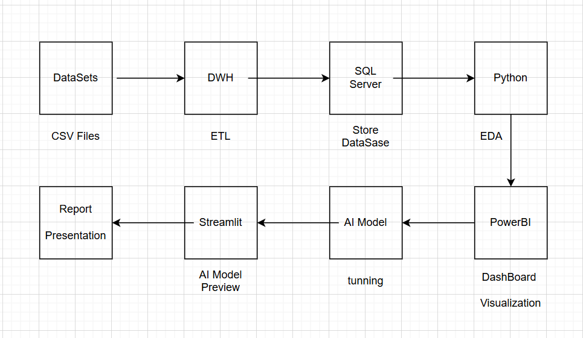
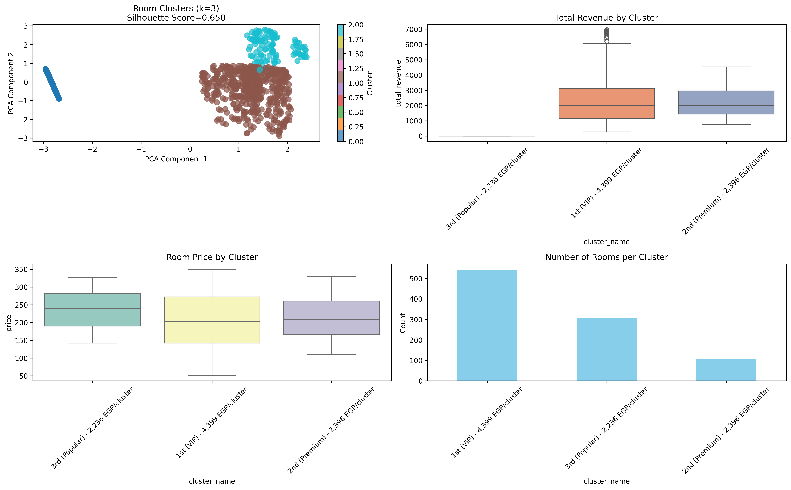
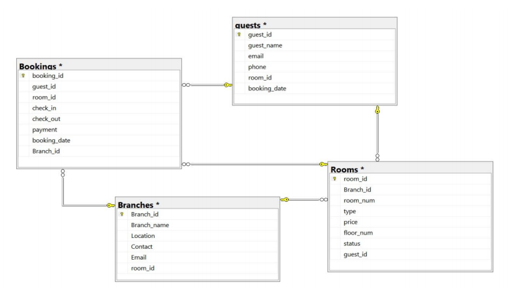
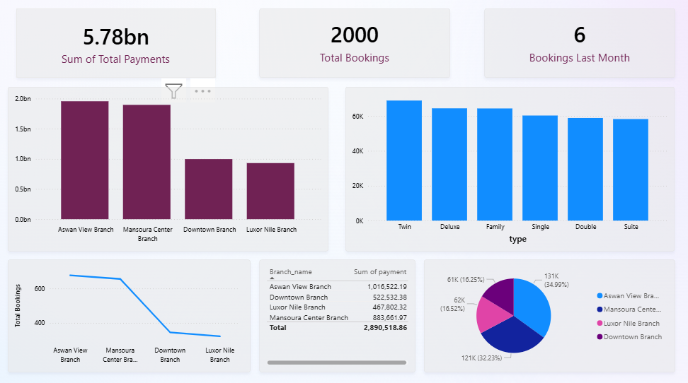

# NHA-018
🏨 Hotel Database Analysis

**Overview**
This project presents a data-driven Hotel Data Analysis and Prediction System designed to convert raw operational hotel data into meaningful insights using Data Warehousing, automated ETL processes, Business Intelligence dashboards, and Machine Learning predictive models. The system enables hotel managers to analyze occupancy patterns, track revenue performance, understand customer behavior, and predict booking cancellations.

**Abstract**
Hotels face challenges in analyzing booking behaviors and forecasting occupancy due to limitations of transactional systems. This project addresses these challenges by integrating a SQL Server Data Warehouse, a Python-based ETL pipeline, Power BI dashboards, and AI predictive models. Together, they form an end-to-end BI + AI workflow that supports strategic decision-making in hospitality management.

**📌 Pipeline Architecture**

**Literature Review Summary**
Research demonstrates that hotels relying on Business Intelligence and predictive analytics achieve better forecasting accuracy, improved pricing strategies, and enhanced operational efficiency. However, most existing research focuses on either analytics or prediction separately. This project fills the gap by integrating both analysis and prediction in a unified system.

**Methods & Materials**
1. Data Extraction
1-Branches
2-Rooms
3-Guests
4-Bookings

2. Data Transformation (Python ETL)
1-Data cleaning
2-Handling null values
3-Standardizing date formats
4-Calculating revenue and stay duration

3. Data Loading (SQL Server Data Warehouse)
1-Fact_Booking
2-Dim_Date
3-Dim_Guest
4-Dim_Room
5-Dim_Branch

4. Data Visualization (Power BI)
1-Revenue dashboards
2-Occupancy trends
3-Guest analytics
4-Branch performance KPIs

5. AI Predictive Models
1-Booking cancellation prediction
2-Occupancy forecasting
3-Tools used: SQL Server, Python, Power BI.

**📌 Data Schema**

**📌 ETL Notebook Code**
[Open ETL Notebook](ETL/app.ipynb)

Summary
Automated ETL built in Python
Data Warehouse built using dimensional modeling
Interactive dashboards created in Power BI
Machine learning model trained on historical booking data
Scalable, reproducible analytical pipeline
Dashboard Visualizations

**📌 Power BI Dashboard**

**Research Results**
Historical booking data stored successfully
Automated ETL reduced processing time and human error
Dashboards revealed seasonal trends, high-performing branches, and revenue peaks
Predictive models achieved strong accuracy in forecasting cancellations

**Key Insight:**
Combining BI + AI significantly improves forecasting, pricing, staffing, and strategic planning in the hotel industry.

**Conclusions and Future Work**
The project delivers a complete analytical and predictive pipeline for hospitality management. Management teams can monitor occupancy, revenue, and guest patterns and can make informed decisions.
**Future Enhancements**
Integration with real-time streaming data
Dynamic pricing optimization using AI
Cloud deployment for remote accessibility
Advanced guest segmentation and behavioral prediction
